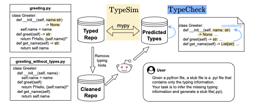

# TypyBench: Evaluating LLM Type Inference for Untyped Python Repositories


TypyBench contains 50 well-typed Python repositories, designed to evaluate LLMs' ability to infer types for untyped Python repositories. TypyBench features two novel metrics:

- TypeSim: captures nuanced semantic relationships between predicted and ground truth types.
- TypeCheck: assesses type consistency across codebases.



## Dataset Download Link

Please check the [this link](https://drive.google.com/file/d/1zeF658KElobutFseLgW1FyxXm-bVKlej/view?usp=sharing) to download the dataset for evaluation.

## Requirements

* Docker Engine

## Evaluation

When LLM generates predictions, arrange the prediction in the following structure:

```
predictions/
  agents/
  appworld/
  AutoGPT/
  ...
```

Then, use the following command to execute the evaluation of a predicted repo:

```shell
# To evaluate all repos under the ./predictions folder with 10 parallel workers
python3 run.py --pred-path ./predictions --num-workers 10
```

If you just want to evaluate a single repo, use the follwoing command:

```shell
python3 run.py --pred-path ./predictions --num-workers 10 --repo agents
```

The results will be generated under the prediction folders, for example:

```shell
predictions/agents/agents_result_dict.pkl
predictions/agents/agents_result_w_exact.csv
```

The `.pkl` file is a cache file that stores all the results of mypy analysis while the evaluation results could be seen in the `.csv` file, for example:

```csv
repo_name,total_vars,overall_score,overall_score_wo_missing,overall_score_exact,overall_score_wo_missing_exact,missing_ratio,depth_1_score,depth_2_score,depth_3_score,depth_4_score,depth_5_score,depth_1_score_exact,depth_2_score_exact,depth_3_score_exact,depth_4_score_exact,depth_5_score_exact,repo_a_consistency,repo_b_consistency,lower_than_5_average,lower_than_10_average,lower_than_5_average_exact,lower_than_10_average_exact
agents,1956,0.7743,0.8825,0.7076,0.8065,0.1227,0.7660,0.8140,0.6947,0.0000,N/A,0.7112,0.7200,0.5111,0.0000,N/A,71,339,0.7533,0.7407,0.6923,0.6816
```

These fields are:

* `repo_name`: The name of the evaluated repository
* `total_vars`: The total number of variables in the evaluation
* `overall_score`: The overall TypySim score
* `overall_score_wo_missing`: The overall TypySim score without variables whose predictions are missing
* `overall_score_exact`: The overall exact matching score
* `overall_score_wo_missing_exact`: The overall exact matching score without variables whose predictions are missing
* `missing_ratio`: The ratio of variables whose predictions are missing
* `depth_1_score`: The TypySim score for variables with their ground truth type annotation has depth 1
* `depth_2_score`: The TypySim score for variables with their ground truth type annotation has depth 2
* `depth_3_score`: The TypySim score for variables with their ground truth type annotation has depth 3
* `depth_4_score`: The TypySim score for variables with their ground truth type annotation has depth 4
* `depth_5_score`: The TypySim score for variables with their ground truth type annotation has depth 5
* `depth_1_score_exact`: The exact matching score for variables with their ground truth type annotation has depth 1
* `depth_2_score_exact`: The exact matching score for variables with their ground truth type annotation has depth 2
* `depth_3_score_exact`: The exact matching score for variables with their ground truth type annotation has depth 3
* `depth_4_score_exact`: The exact matching score for variables with their ground truth type annotation has depth 4
* `depth_5_score_exact`: The exact matching score for variables with their ground truth type annotation has depth 5
* `repo_a_consistency`: The TypeCheck score (number of mypy check errors) for the original repository
* `repo_b_consistency`: The TypeCheck score (number of mypy check errors) for the predicted repository
* `lower_than_5_average`: The average TypySim score of variables whose frequency is lower than 5 in the original repository
* `lower_than_10_average`: The average TypySim score of variables whose frequency is lower than 10 in the original repository
* `lower_than_5_average_exact`: The average exact matching score of variables whose frequency is lower than 5 in the original repository
* `lower_than_10_average_exact`: The average exact matching score of variables whose frequency is lower than 10 in the original repository

where the depth of a type is defined as the number of levels in the type hierarchy, for example, `int` has depth 1, `List[int]` has depth 2, `List[List[int]]` has depth 3, etc.

## Citation

If you found this repo is useful for your research, please consider citing our research paper:

```
@inproceedings{
  dong2025typybench,
  title={TypyBench: Evaluating {LLM} Type Inference for Untyped Python Repositories},
  author={Honghua Dong and Jiacheng Yang and Xun Deng and Yuhe Jiang and Gennady Pekhimenko and Fan Long and Xujie Si},
  booktitle={Forty-second International Conference on Machine Learning},
  year={2025},
  url={https://openreview.net/forum?id=xl9sv9vEDy}
}
```

## License

Please refer to the [LICENSE](LICENSE) file.